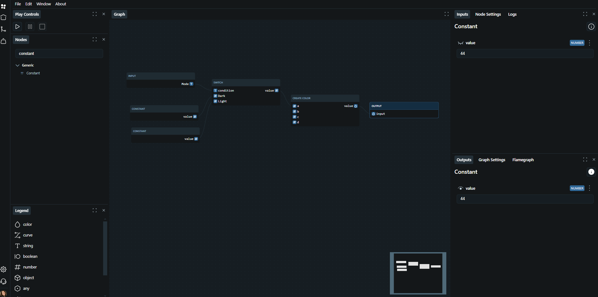

The Graph Engine is a visual node based builder which can be used to create reproducible workflows to produce output artifacts. At [Tokens Studio](https://tokens.studio/) this is used to create workflows to create advanced Design tokens in a consistent manner that can easily be shared, but the Graph Engine project is intended for any form of workflow and can be easily extended to provide additional behaviour

## Features

- Built with Typescript and ESM
- Fully open source
- Built for containers and intended for cloud native usage
- Customizable for additional use cases