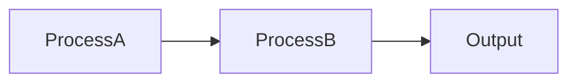

# Graph

## What is a graph?

A graph is a collection of [nodes](./nodes.md) and edges that represent and declarative way to show relationships. If we were to define a node as a blackbox of computation acting on some data, by chaining together nodes we can show data is transformed as a flows between the nodes.

## Metadata

There will always be use cases where additional information is needed for a node. Who is the author, when was it last updated, is there a url for documentation? To support this, all graphs have an `annotations` property which can support arbitrary metadata. The most common attribute on this graph will likely be `engine.version`. This tracks which version of the graph engine library was used to create a graph and helps to make sure that newer graphs are not run on older engines as this would likely cause a break. Upgrading graphs from older versions should be done through our [migrations](https://www.npmjs.com/package/@tokens-studio/graph-engine-migration) package which can help upgrade older versions to newer ones.

## Capabilities

In some cases the graph requires access to external libraries for nodes. A good example of this is the [web audio API](https://developer.mozilla.org/en-US/docs/Web/API/Web_Audio_API) which is not available natively in runtimes such as NodeJS. To get around this, nodes would have to be:

1. Runtime specific - This is not a good solution as we might want isomorphism between executing a graph between server and client, and trying to swap out runtime specific nodes is messy and error prone.
2. The nodes themselves load a library that contains a polyfill which fixes the isomorphism problem. This can result in increased bundle sizes on the front end, as well as not support additional runtimes. Additionally different nodes might be using different polyfills or versions which could cause conflicts
3. The nodes request the library from the graph engine as a _capability_. If the engine does not have the capability to provide the requested library, an error is thrown immediately. This also gives power to the developer as they are free to handle how this is provided depending on the runtime. Additionally capabilities can be locked and removed if the consumer executing the graph wishes to do so if they consider them to be unsafe, or they can be changed out independently to be safer.

To simplify, _capabilities_ are global graph based features that affect all or most nodes. If this is not true, the feature should be implemented at a node level and then pass context, etc between nodes. These should be loaded and available to the graph prior to loading any nodes
