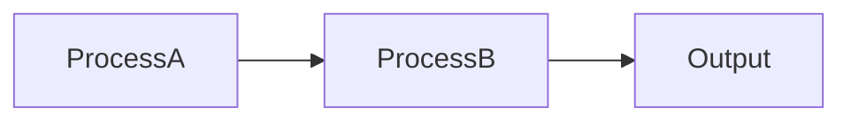

# Graph

## What is a graph?

A graph is a collection of [nodes](./nodes.md) and edges that represent and declarative way to show relationships. If we were to define a node as a blackbox of computation acting on some data, by chaining together nodes we can show data is transformed as a flows between the nodes.

## Metadata

There will always be use cases where additional information is needed for a node. Who is the author, when was it last updated, is there a url for documentation? To support this, all graphs have an `annotations` property which can support arbitrary metadata. The most common attribute on this graph will likely be `engine.version`. This tracks which version of the graph engine library was used to create a graph and helps to make sure that newer graphs are not run on older engines as this would likely cause a break. Upgrading graphs from older versions should be done through our [migrations](https://www.npmjs.com/package/@tokens-studio/graph-engine-migration) package which can help upgrade older versions to newer ones.