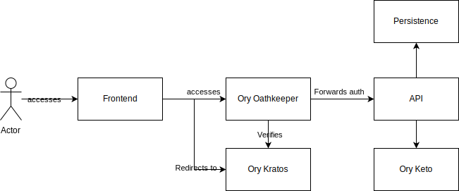

# Architecture

The entirety of the Graph Engine is written in [typescript](https://www.typescriptlang.org/).

## Graph Architecture


An important note here is that the editor and the engine core are seperated. By preventing strong coupling between the two we allow users to implement their own custom UI, as well as reduce the weight of the packages and keep a clear seperation of concerns.

The editor is responsible for human manipulation and debugging of graphs, as such it requires a lot more tools and packages to visually display this.

Custom nodes contain 3 pieces.

1. The actual node code. This is kept seperate from the UI for the above reasons
2. UI code. This could be multiple things, such as custom controls, custom UI nodes, icons, etc
3. JSON schemas. This helps to identify unique data types as well as providing runtime type checking if needed.

Since this information can be arranged differently depending on the implementor, we expect the following properties on a node package definition

```
{
    //...

    "graph-engine":{
        "nodes":{
            //Node name and path to the node and the import path, eg import default from "mypkg/nodes/example.js"
            "studio.tokens.example":"./nodes/example.js"
        }
    }

}

```

## Network Architecture

We use the following services to help with the system

- [Ory Kratos](https://github.com/ory/kratos)

This helps us manage users to system and support for security mechanisms like multifactor authentication, Social logins, custom identities,etc

- [Ory Oathkeeper](https://github.com/ory/oathkeeper)

An Idenity & Access Proxy. Oathkeeper is used in conjunction with Kratos to handle sessions and support zero trust networks. It authenticates requests and simplifies the actual API backend to focus on its core logic

- [Ory Keto](https://github.com/ory/keto)

A modern permission system that can scale with complex ACL based on [Google's Zanzibar system](https://research.google/pubs/pub48190/)


