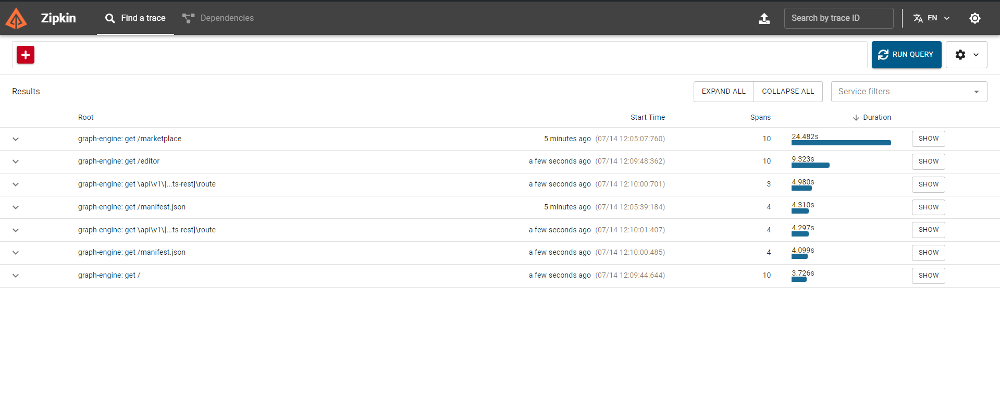
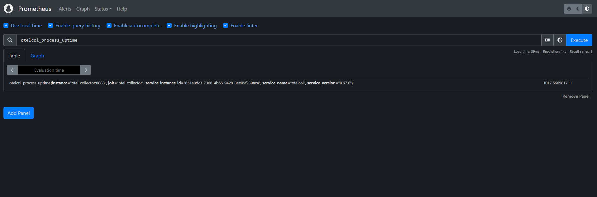

# UI

This is the custom opinionated UI for the graph-engine for [Tokens Studio](https://tokens.studio)

It is highly opinonated and subject to change. We encourage you to create your own server following the principles shown in this project

## Setup

1. Setup Auth

You will need to create a [github app](https://developer.github.com/apps/building-oauth-apps/authorizing-oauth-apps) first to handle auth. You will likely need to use `http://localhost:3000/api/auth/callback/github` as your callback url.

Make sure to allow email as a required permission.

Once this is completed, create a `.env.local` file and replace the values `AUTH_GITHUB_ID`,`AUTH_GITHUB_SECRET` values from your app

2. Setup the database

The app needs to persist values and thus needs a database.

You can run the docker-compose in the root of this project to setup the database. Otherwise you will need to setup your own database and override the values in the system.

You will need to run the migrations once using `npm run db:deploy`. This command should be run in this folder

3. Start the server

Run `npm run dev:ui:live` from the root of the project to get live updates

## Debugging

For complicated queries you might need to use Open Telemetry to watch network requests. For this you should run the `docker-compose.debugging.yaml` in the root of this project with the following command

```sh
docker-compose -f docker-compose.debugging.yaml up
```

This will create the required services which the project will push to with the instrumentation hooks.

Next you will need to enable open telemetry for the project. Add the following to your `.env.local`

```
# ...
OTEL_ENABLED=true
```

Now next time you start the server you should be emitting open telemetry data. To test this, run the server with `npm run dev:ui` from the root of this project, and open `http://localhost:3000` to load the initial page.

Then open `http://localhost:9411` to look at the zipkin traces after your page finishes loading. You should see something like this after pressing the `run query` button



Next check that prometheus is getting data. Open `http://localhost:9090` to open the prometheus UI.

In the search bar add `otelcol_process_uptime` and execute the query. You should see something like the following


